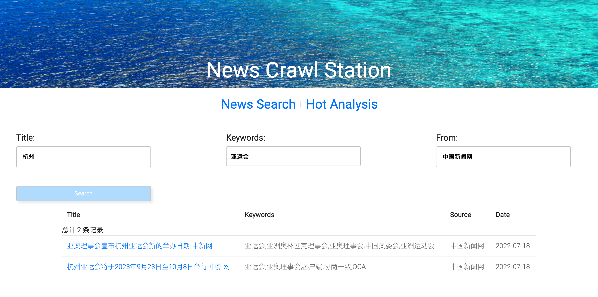
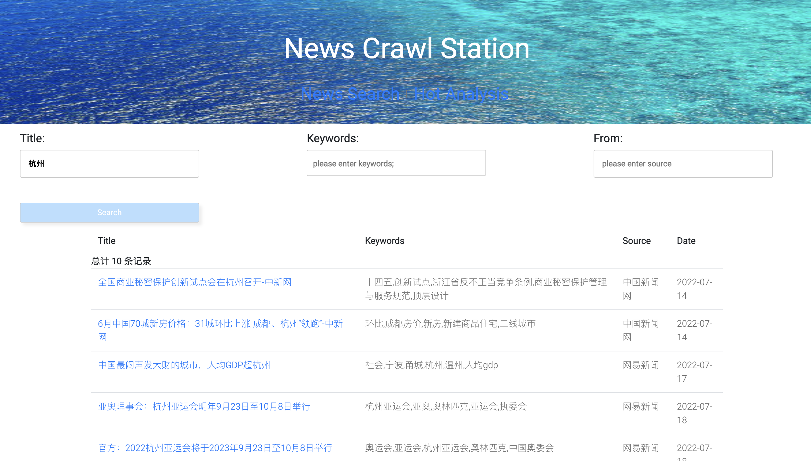
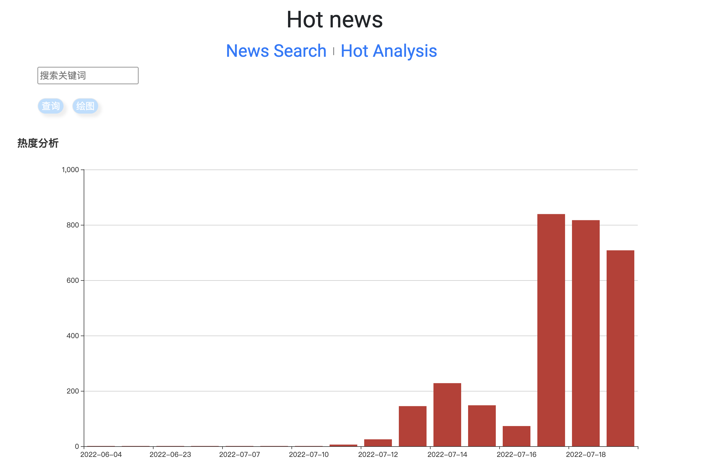
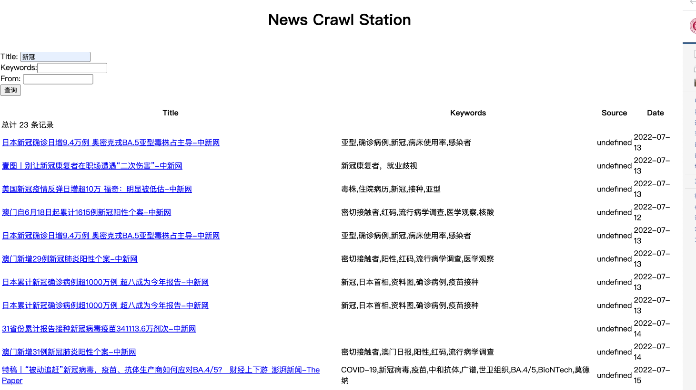
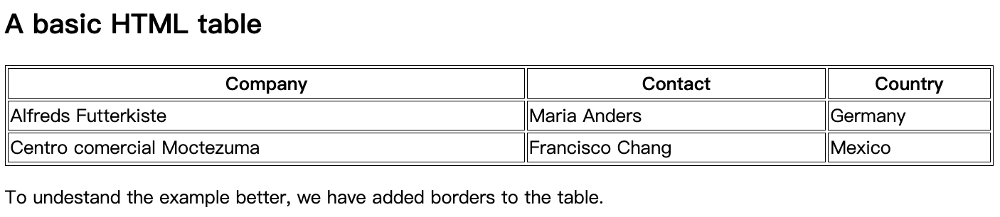
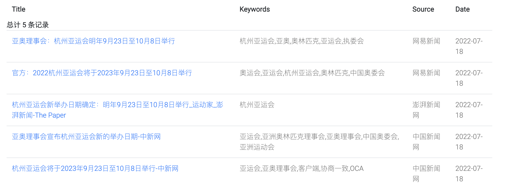
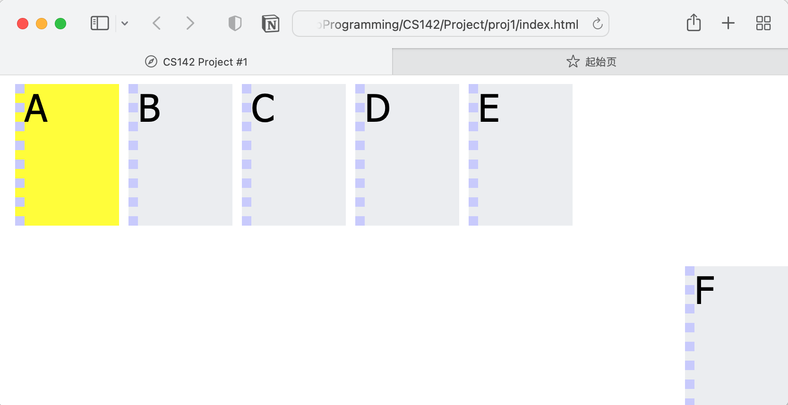
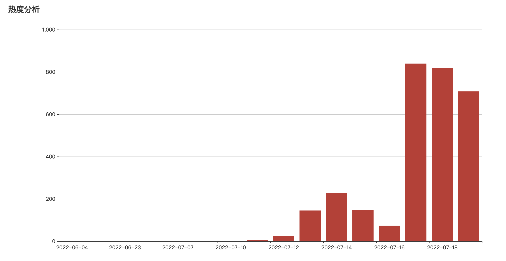

# DaSE-Web
 Final proj for DaSE Web development Sum22



### 任务目标

- [x] 新闻网站数据信息爬取

- [x] 新闻网站数据信息存储

- [x] 网页框架搭建

- [x] 多重条件搜索

- [x] 表格数据显示

- [x] 新闻关键词热度分析和图形化展示

  

### 环境及前置知识准备

#### 1. 安装Nodejs

- Windows操作系统使用官网下载链接：https://nodejs.org/en/download/

- MacOS操作系统可采用HomeBrew进行包安装：`brew install node `
  - 如果提示brew相关报错，请在安装前输入`brew update`以及`brew doctor`

#### 2. 安装MySQL

MacOS操作系统下通过Homebrew安装MySQL有许多注意点，具体步骤可参见我在这个👉链接:[安装教程指导](https://github.com/TOMYUE/ECNU-DaSE-Pieces/blob/main/tools/MySQL%20install%20guide.md)写的文章，其中还有可靠的安装视频教程。

#### 3. 安装express

`express`安装教程可参见官网:https://expressjs.com/zh-cn/starter/generator.html，其中我们主要使用的是Express的应用生成器。

简要步骤如下：

1. `npm install express`

2. `npx express-generator`

3. 到此步骤后，输入`express`后回车，检查是否会提示express命令不可用，没有的话就完成了express安装
4. 新建一个新的文件夹，并在其目录位置运行终端，输入`express -e search_site`
5. 在此文件夹下，同时运行`npm install mysql`使得后端的SQL数据库可以支持数据检索查询，后文中会叙述如何把`mysql.js`文件放到合适的工程文件目录下，以及修改`index.js`和`search.html`，并新建编写更多的跳转网页。

#### 4. 使用bootstrap

使用官网教程https://getbootstrap.com/docs/3.4/getting-started/

#### 5. 正则表达式 

正则表达式作为非常重要的工具，无论在刷题还是实践中都具有重要作用，以下这个网站可以帮助无痛学会正则表达式，只需花费3h左右完成对应的教学题（lesson notes）和练习题（practice problem），应该就会让你不再记不住：https://regexone.com/lesson/introduction_abcs

#### 6. 网页信息分析

`cherrio`以及`JQuery`的使用，在`f12`的帮助下进入控制台逐行分析即可，点开小箭头后就可以直接随拖到你想要的内容的地方可以反向查看对应的`html`源代码了。

#### 7. ECharts使用

参见ECHARTS官方文档:https://echarts.apache.org/handbook/en/basics/download/


## 网页整体效果

### 

### 文件结构


## 网页数据爬取

​       我选取了三家新闻网站：网易新闻、中国新闻网、澎湃新闻进行爬取。爬取工作的代码实现主要分为四个部分：各部分爬取信息的定位、分析网页结构定制`jquery`语句、读取主网页并轮询子网页、获取各部分信息并写入数据库。


## 网页数据存储

​        在将爬入的数据写入数据库中的过程，需要进行建表、访问SQL数据库、读取和检索数据的响应。

### 建表

```sql
CREATE TABLE `news` (
  `id_fetches` int(11)  NOT NULL AUTO_INCREMENT,
  `url` varchar(200) DEFAULT NULL,
  `source_name` varchar(200) DEFAULT NULL,
  `source_encoding` varchar(45) DEFAULT NULL,
  `title` varchar(200) DEFAULT NULL,
  `keywords` varchar(200) DEFAULT NULL,
  `author` varchar(200) DEFAULT NULL,
  `publish_date` date DEFAULT NULL,
  `crawltime` datetime DEFAULT NULL,
  `content` longtext,
  `createtime` datetime DEFAULT CURRENT_TIMESTAMP,
  PRIMARY KEY (`id_fetches`),
  UNIQUE KEY `id_fetches_UNIQUE` (`id_fetches`),
  UNIQUE KEY `url_UNIQUE` (`url`)
) ENGINE=InnoDB DEFAULT CHARSET=utf8;
```

### 访问数据库

建好表后，对于访问数据库，可以现在mysql终端中进行查看，输入`describe news;`我就可以查看新建的名为`news`的表格的信息，你只需把news换成你自己的表明就行了。显示如下：

```sql
mysql> describe news;
+-----------------+--------------+------+-----+-------------------+-------------------+
| Field           | Type         | Null | Key | Default           | Extra             |
+-----------------+--------------+------+-----+-------------------+-------------------+
| id_fetches      | int          | NO   | PRI | NULL              | auto_increment    |
| url             | varchar(200) | YES  | UNI | NULL              |                   |
| source_name     | varchar(200) | YES  |     | NULL              |                   |
| source_encoding | varchar(45)  | YES  |     | NULL              |                   |
| title           | varchar(200) | YES  |     | NULL              |                   |
| keywords        | varchar(200) | YES  |     | NULL              |                   |
| author          | varchar(200) | YES  |     | NULL              |                   |
| publish_date    | date         | YES  |     | NULL              |                   |
| crawltime       | datetime     | YES  |     | NULL              |                   |
| content         | longtext     | YES  |     | NULL              |                   |
| createtime      | datetime     | YES  |     | CURRENT_TIMESTAMP | DEFAULT_GENERATED |
+-----------------+--------------+------+-----+-------------------+-------------------+
11 rows in set (0.22 sec)
```


### 访问数据库

```javascript
var mysql = require("mysql");
var pool = mysql.createPool({
    host: '127.0.0.1',
    user: 'root',
    password: '你自己的密码',//填入你自己的密码
    database: 'WebCrawl'
});
/** 两种不同的调用mysql的方式 */
var query = function(sql, sqlparam, callback) {
    pool.getConnection(function(err, conn) {
        if (err) {
            callback(err, null, null);
        } else {
            conn.query(sql, sqlparam, function(qerr, vals, fields) {
                conn.release(); //释放连接 
                callback(qerr, vals, fields); //事件驱动回调 
            });
        }
    });
};
var query_noparam = function(sql, callback) {
    pool.getConnection(function(err, conn) {
        if (err) {
            callback(err, null, null);
        } else {
            conn.query(sql, function(qerr, vals, fields) {
                conn.release(); //释放连接 
                callback(qerr, vals, fields); //事件驱动回调 
            });
        }
    });
};
exports.query = query;
exports.query_noparam = query_noparam;
```

此段代码中这两种不同的使用js访问sql的方式，我看不懂，能知道在干什么，但是对于具体底层的交互不清楚，在学习完数据库相关知识后再来做了解🫡。


### 读取数据库条目

在只有简单的一个`html`和`js`进行前后端交互时，交互的接口就是通过`<form>`标签里`action`触发的. 具体可以参见老师给的`7.03.js`

和 `7.03.html`的代码：

html：

```html
<!DOCTYPE html>
<html>
<body>
    <form action="http://127.0.0.1:8080/process_get" method="GET">
        <br> title: <input type="text" name="title">
        <input type="submit" value="Submit">
    </form>
    <script>
    </script>
</body>
</html>
```

js:

```javascript
var express = require('express');
var mysql = require('./mysql.js')
var app = express();
//app.use(express.static('public'));
app.get('/7.03.html', function(req, res) {
    res.sendFile(__dirname + "/" + "7.03.html");
})
app.get('/process_get', function(req, res) {
    res.writeHead(200, { 'Content-Type': 'text/html;charset=utf-8' }); //设置res编码为utf-8
    //sql字符串和参数
    var fetchSql = "select url,source_name,title,author,publish_date from news where title like '%" +
        req.query.title + "%'";
    mysql.query(fetchSql, function(err, result, fields) {
        console.log(result);
        res.end(JSON.stringify(result));
        console.log("\n");
    });
})
var server = app.listen(8080, function() {
    console.log("访问地址为 http://127.0.0.1:8080/7.03.html")
})
```

<font color='red'>注意：如果出现input按钮为乱码，但是又觉得自己js文件里的读取定义过是utf-8，则直接在html文件的head标签上进行`accept-charset='utf-8'`的改动</font>，此错误我在没有实验7.03直接写网页那里的前端的时候遇到后寻找了很久，**也非常感谢耐心的“武助教”帮我一起不停的找问题，适逢疫情只能微信截图交流，非常感谢武助教和周助教两位助教哥哥耐心又细致的帮助🙏**

​        有了这个基础后，我们再来看我们实际在express中的代码：

```js
//引入express模块，引入mysql.js 注意，这个mysql.js在上层文件夹中，所以要用 ../
var express = require('express');
var router = express.Router();
var mysql = require('../mysql.js');

/* GET home page. */
router.get('/', function(req, res, next) {
  res.render('index', { title: 'Express' });
});

//router.get简单来说就是你要几个地方用就写几个，对应的html页面里action=后面加上就行了
router.get('/process_get', function(request, response) {
  //sql字符串和参数,和前面一样，搜索我们需要的东西，由于要多重条件搜索，就加上多个条件就行了
  var fetchSql = "select url, title, keywords, author, publish_date, source_name " +
      "from news where title like '%" + request.query.title + "%'" +
      "and keywords like '%" + request.query.keywords + "%'" +
      "and source_name like '%" + request.query.source_name + "%';";

  mysql.query(fetchSql, function(err, result, fields) {
    response.writeHead(200, {
      "Content-Type": "application/json"
    });
    response.write(JSON.stringify(result));
    response.end();
  });
});

router.get('/keywords_get', function (request, response) {
  //sql字符串和参数
  var fetchSql = "select publish_date from news where keywords like" + "'%" + request.query.keywords + "%'";

  mysql.query(fetchSql, function (err, result, fields) {
    response.writeHead(200, {
      "Content-Type": "application/json"
    });
    response.write(JSON.stringify(result));
    response.end();
  });
});

module.exports = router;
```


### <font color='red'>连接数据库的注意点</font>

在访问使用js访问数据库的时候，我最早在希望把爬虫的数据写入数据库的时候，遇到了无法写入的问题，报错如下：

```sql
Client does not support authentication protocol requested by server; consider upgrading MySQL client
```

如果你也遇到这样的报错，参考[这个stackoverflow的答案](https://stackoverflow.com/questions/50093144/mysql-8-0-client-does-not-support-authentication-protocol-requested-by-server),具体做法是在mysql的终端中输入：`ALTER USER 'root'@'localhost' IDENTIFIED WITH mysql_native_password BY 'password'`,root的地方如果你给自己的host命名就是root那就是root，localhost就写localhost因为这个网页是运行在我们机器本地的，password就写你自己的password就行了。然后再在终端中输入`flush privileges;`就行了。


## 网页框架搭建

以下介绍的只是基本操作，完成只能实现基本的骨架一样的网页，比如这样的：

### 建立文件夹 search_site

- 建立一个search_site 文件夹

- 将mysql.js拷贝到这个文件夹

- 引入mysql配置，`npm install mysql --save`

- 按照需求安装相关的`package.json`中的依赖

  

### 修改index.js 和search.html

#### index.js

`index.js`和之前7.03.js并无太大区别，只是会承接更多的前端`html`页面给出的响应需求，多写几个`router.get()`就行了。

```js
//引入express模块，引入mysql.js 注意，这个mysql.js在上层文件夹中，所以要用 ../
var express = require('express');
var router = express.Router();
var mysql = require('../mysql.js');

/* GET home page. */
router.get('/', function(req, res, next) {
  res.render('index', { title: 'Express' });
});

router.get('/process_get', function(request, response) {
  //sql字符串和参数,和前面一样，搜索我们需要的东西
  var fetchSql = "select url, title, keywords, author, publish_date, source_name " +
      "from news where title like '%" + request.query.title + "%'" +
      "and keywords like '%" + request.query.keywords + "%'" +
      "and source_name like '%" + request.query.source_name + "%';";

  mysql.query(fetchSql, function(err, result, fields) {
    response.writeHead(200, {
      "Content-Type": "application/json"
    });
    response.write(JSON.stringify(result));
    response.end();
  });
});

router.get('/keywords_get', function (request, response) {
  //sql字符串和参数,来满足你需要的其他需求
  var fetchSql = "select publish_date from news where keywords like" + "'%" + request.query.keywords + "%'";

  mysql.query(fetchSql, function (err, result, fields) {
    response.writeHead(200, {
      "Content-Type": "application/json"
    });
    response.write(JSON.stringify(result));
    response.end();
  });
});

module.exports = router;
```


#### Search.html

html可以看作在搭积木，想好需要几个元件就好了，比如在这里我们可能需要一个标题，一个输入框，一个搜索按钮，一个表格，那就是`<h1>和<input>和<input>和<table>`，那么具体的用法就去MDN官网搜一下就可以啦！

 此处先展示，最简陋版没有加上任何css文件以及div套div手动写元素排列方式的版本：

```html
<!DOCTYPE html>
<html>
<header>
    <script src="https://cdn.bootcss.com/jquery/3.4.1/jquery.js"></script>
</header>
<body>
    <form>
        <br> 标题：<input type="text" name="title_text">
        <input class="form-submit" type="button" value="查询">
    </form>
    <div class="cardLayout" style="margin: 10px 0px">
        <table width="100%" id="record2"></table>
    </div>
    
    <script>
//上面是引入jquery的包，下面是操作代码。但是jquery我也没系统学习过，所以这里很多功能不是很明白
        $(document).ready(function() {
            //对查询按钮进行了一个操作，就是click后会进行下面操作
            $("input:button").click(function() {
                $.get('/process_get?title=' + $("input:text").val(), function(data) {
                    $("#record2").empty();
                    $("#record2").append('<tr class="cardLayout"><td>url</td><td>source_name</td>' +
                        '<td>title</td><td>author</td><td>publish_date</td></tr>');
                    //查询完后，信息放在data当中
                    for (let list of data) {
                        let table = '<tr class="cardLayout"><td>';
                        //对其遍历，每一行都把具体的数据放到每一行中去
                        Object.values(list).forEach(element => {
                            table += (element + '</td><td>');
                        });
                        $("#record2").append(table + '</td></tr>');
                    }
                });
            });

        });
    </script>
</body>
</html>
```


### 显示查询结果

在文件夹下打开终端输入`node bin/www`查看演示效果


## 多重条件检索

多重条件搜索和单一条件搜索实现上可以看作是把一样东西写三遍，就是多建两个`<input>`框，然后`router.get()`的sql语句使用以下条件判断`where`, 以我要搜索标题、关键字、url为例：`select title, keywords, url from news where title like '%%' and keywords like '%%' and url like '%%'; `

显示到代码上就是把上面的sql语句用应该替换的变量给替换掉

```js
router.get('/process_get', function(request, response) {
  //sql字符串和参数,和前面一样，搜索我们需要的东西
  var fetchSql = "select url, title, keywords, author, publish_date, source_name " +
      "from news where title like '%" + request.query.title + "%'" +
      "and keywords like '%" + request.query.keywords + "%'" +
      "and source_name like '%" + request.query.source_name + "%';";

  mysql.query(fetchSql, function(err, result, fields) {
    response.writeHead(200, {
      "Content-Type": "application/json"
    });
    response.write(JSON.stringify(result));
    response.end();
  });
});
```


## 表格数据显示

使用表格对搜集到的信息进行一一展示，我们先熟悉一下表格常用的格式，如下所示：

```html
<!DOCTYPE html>
<html>
<style>
table, th, td {
  border:1px solid black;
}
</style>
<body>

<h2>A basic HTML table</h2>

<table style="width:100%">
  <tr>
    <th>Company</th>
    <th>Contact</th>
    <th>Country</th>
  </tr>
  <tr>
    <td>Alfreds Futterkiste</td>
    <td>Maria Anders</td>
    <td>Germany</td>
  </tr>
  <tr>
    <td>Centro comercial Moctezuma</td>
    <td>Francisco Chang</td>
    <td>Mexico</td>
  </tr>
</table>

<p>To undestand the example better, we have added borders to the table.</p>

</body>
</html>

```



那回到我们自己的代码，我们在`search.html`中不断得到的data的过程中同时在为每一条数据条目形成一个一行的表格，见代码，每一个`tableline`都是一个一行的表格，不断加到总的表格上去：

```js
let table = '<tr><td>';
tableline += ('<a href=' + data[i].url + '>' + data[i].title + '</a></td><td>');
tableline += (data[i].keywords + '</td><td>');
tableline += (data[i].source_name + '</td><td>');
tableline += (data[i].publish_date.substring(0, 10) + '</td></tr>');  // 日期只取精确到日
$("#record2").append(tableline);
```

那么完整的`search.html`如下所示：其中加入了不会少internal css和external css是为了不和bootstrap的使用起冲突加的，水平不足还请谅解。

```html
<!DOCTYPE html>
<html>
<head>
    <script src="https://cdn.bootcss.com/jquery/3.4.1/jquery.js"></script>
    <meta charset="utf-8">
    <meta name="viewport" content="width=device-width, initial-scale=1, shrink-to-fit=no">
    <link href="https://fonts.googleapis.com/css?family=Roboto:300,400&display=swap" rel="stylesheet">

    <link rel="stylesheet" href="fonts/icomoon/style.css">

    <link rel="stylesheet" href="css/owl.carousel.min.css">

    <!-- Bootstrap CSS -->
    <link rel="stylesheet" href="css/bootstrap.min.css">

    <!-- Style -->
    <link rel="stylesheet" href="css/style.css">
    <link rel="stylesheet" href="scss/style.scss">
    <title>news station</title>
</head>
<style>
    body {
        background-image: url("./images/Ocean.jpg");
        background-repeat: no-repeat;
        background-attachment: fixed;
        background-position: top center;
        background-size: 100% 27%;
    }
    .form-submit-button {
        background: #B9DFFF;
        color: #fff;
        border: 1px solid #eee;
        border-radius: 20px;
        box-shadow: 5px 5px 5px #eee;
        text-shadow: none;
    }
    .form-submit-button:hover {
        background: #016ABC;
        color: #fff;
        border: 1px solid #eee;
        border-radius: 20px;
        box-shadow: 5px 5px 5px #eee;
        text-shadow: none;
    }
</style>
<body>
<link href="stylesheets/style.scss" rel="stylesheet" type="text/css">


<div class="content">
<!--   <div class="container">-->
       <center>
           <div style="font-size: 50px; color: white; top: 20px; padding: 20px"> News Crawl Station </div></center>

       <div style="display: flex; width: auto; flex-display:row; position: relative;left: 37%">
           <div>
               <div style="font-size: 30px"><a href="search.html">News Search</a></div>
           </div>
           <div style="color: #727577; padding: 10px">  |  </div>
           <div>
               <div style="font-size: 30px"><a href="analyse.html">Hot Analysis</a></div>
           </div>
       </div>

<!--       -->
       <form accept-charset="UTF-8">

       <br>
           <div style="display: flex;width: 100%; flex-display:row;justify-content: space-between;position: relative; margin-left: 20px">
               <div style="width: 30%; position: relative; padding: 20px" >
                    <div><h5>Title:</h5></div>
                    <input type="text" name="title_text" placeholder="please enter title"
                           style="outline-style: none ;
                                  border: 1px solid #ccc;
                                  border-radius: 3px;
                                  padding: 13px 14px;
                                  width: 315px;
                                  font-size: 14px;
                                  font-weight: 700;">
               </div>

               <div style="width:30%; position: relative; padding: 20px;">
                   <div><h5>Keywords:</h5></div>
                    <input type="text" name="keywords_text" placeholder="please enter keywords;"
                           style="outline-style: none ;
                                  border: 1px solid #ccc;
                                  border-radius: 3px;
                                  padding: 13px 14px 10px 10px;
                                  width: 315px;
                                  font-size: 14px;
                                  font-weight: 700;">
               </div>
               <div style="width:30%; position: relative; padding: 20px" >
                   <div><h5>From:</h5></div>
                    <input type="text" name="source_name_text" placeholder="please enter source"
                           style="outline-style: none ;
                                  border: 1px solid #ccc;
                                  border-radius: 3px;
                                  padding: 13px 14px;
                                  width: 315px;
                                  font-size: 14px;
                                  font-weight: 700;">
               </div>
           </div>
       <br>
           <div style="display: flex;width: 100%; flex-display:row; position: center; margin-left: 40px">
                <input class="form-submit-button" type="button" value="Search" onclick="search();" style="outline-style: none ;
                            border: 1px solid #ccc;
                            border-radius: 3px;
                            padding: 6px;
                            width: 315px;
                            font-size: 14px;
                            left: 37%">
           </div>

       </form>
<!--       -->
       <div class="container">
       <h4 id="record"></h4>
       <div class="table-responsive">
           <table id="record2" class="table custom-table">
<!-- append to fill the table -->
           </table>
       </div>
   </div>
</div>


<script>
    function search() {
        $.get('/process_get?title=' + $("input[name='title_text']").val() + '&keywords=' + $("input[name='keywords_text']").val() + '&source_name=' + $("input[name='source_name_text']").val(), function (data) {
            $("#record2").empty();
            $("#record2").append('总计 ' + data.length + ' 条记录');
            $("#record2").append(
                '<thead><tr>' +
                '<th scope="col"><b>Title</b></th>' +
                '<th scope="col"><b>Keywords</b></th>' +
                '<th scope="col"><b>Source</b></th>' +
                '<th scope="col"><b>Date</b></th>' +
                '</tr>' +
                '</thead><tbody>'
            );
            for (let i = 0; i < data.length; i++) {
                console.log(data[i]);
                if(i % 2 === 0) {
                    let table = '<tr><td>';
                    table += ('<a href=' + data[i].url + '>' + data[i].title + '</a></td><td>');
                    table += (data[i].keywords + '</td><td>');
                    table += (data[i].source_name + '</td><td>');
                    table += (data[i].publish_date.substring(0, 10) + '</td></tr>');  // 日期只取精确到日
                    $("#record2").append(table);
                }
                else{
                    let table = '<tr class="active-row"><td>';
                    table += ('<a href=' + data[i].url + '>' + data[i].title + '</a></td><td>');
                    table += (data[i].keywords + '</td><td>');
                    table += (data[i].source_name + '</td><td>');
                    table += (data[i].publish_date.substring(0, 10) + '</td></tr>');  // 日期只取精确到日
                    $("#record2").append(table);
                }
            }
            $("#record2").append('</tbody>');
        });
    }
</script>
<script src="js/jquery-3.3.1.min.js"></script>
<script src="js/popper.min.js"></script>
<script src="js/bootstrap.min.js"></script>
<script src="js/main.js"></script>
</body>
</html>
```

设置完成后我们的表格就成这样了：



## css元素布局

在上面的都完成后，我们就是要进行网页都最后美化，这里对于表格我使用了bootstrap的样式对于表格进行了美化，其他输入和搜索框都只通过基本的css进行样式调整。完整的css文件稍长，就不列于此处，可在github文件夹中找到。

### 横向布局

为使得div能够横向布局，我们需要使用一个`flex`，具体可去MDN官网搜索，这里就显示一个类名为`flex-container`的样式为例：

```css
.flex-container {
    top: 0;
    left : 10;
    width: 100vw;
    display: flex;
    flex-direction: row;
    flex-wrap: nowrap;
    position: fixed;
    padding: 5px;
}
```

注意这里几个重要的就是`display:`使得flex特性打开，`flex=direction:`保证被包裹的元素会是横向排列的，`flex-wrap:`保证这些元素不会换行，其次`width:100vw`使得这些被本样式包裹的元素在全屏的情况下是横向充满这个屏幕的。如果要设置整个flex内部各个div之间的距离保持完全等距可以使用`justify-self: center;
    `  `justify-content: space-between;`这两个property

一个Stanford CS142课程的proj1作为参考，可以去课程官网查看这个proj1.



## 关键词热度分析

通过jquery在获取到信息的时候进行进一步的过滤检索，先获得每个天数里的某一特定关键词出现的频率，实现代码如下：

```js
$.get('/keywords_get?keywords=' + $("input:text").val(), function (data) {
        let datelist = [];
        let DateForNum = new Array();
        for (let i = 0; i < data.length; i++) {
            let publish_date = data[i].publish_date.substring(0, 10);
            if (publish_date in DateForNum) {
                DateForNum[publish_date] += 1;
            }
            else {
                DateForNum[publish_date] = 1;
                datelist.push(publish_date);
            }
        }
        var dateSort = Object.keys(DateForNum).sort();
        datelist = datelist.sort();
        console.log(datelist);
        dataX = []
        for(let i = 0; i < datelist.length; ++i) {
            dataX[i] = DateForNum[datelist[i]];
        }
```

处理好横纵轴的数据后可以用固定的模板进行套用，比如最简单的柱状图：

```js
var myChart = echarts.init(document.getElementById('main'));
myChart.setOption({
    title: {
        text: '热度分析'
    },
    legend: {
        data: ['数量']
    },
    xAxis: {
        data: dateSort
    },
    yAxis: {
    },
    series: [{
        name: '相关报道数',
        type: 'bar',
        data: dataX
    }]
})
```




## 总结

​       在20多天的学习中，从对于js不熟悉，到可以简单编写html进行编写简单的内容，再结合外部css文件进行简单的网页渲染美化，再进一步学习了js的一些特性，初步了解了`javascript`；通过学习了express脚手架能制作一个简单的前后端交互的网页，也通过学习MUI、Bootstrap等框架体会了前端的乐趣，十分有收获，王老师给的示例代码为最初的摸索学习提供了很快的学习路径，两位助教哥哥的帮助也给予了我极大的帮助在网页的debug上有所提升，万分感谢！
